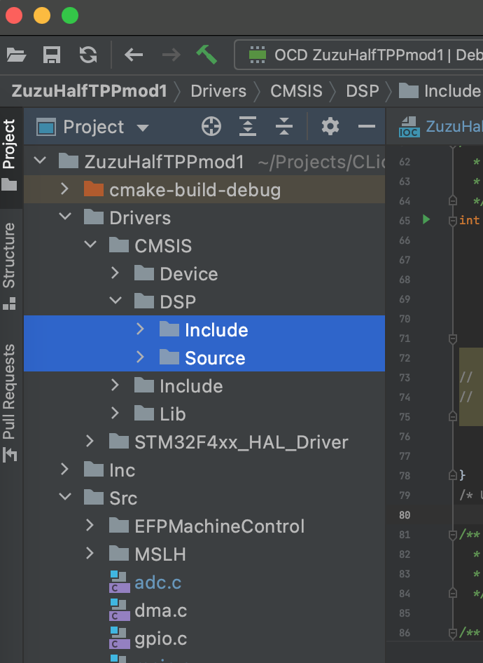
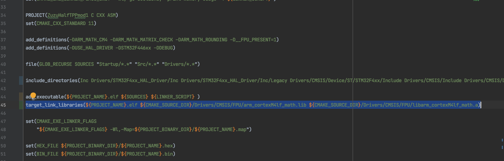
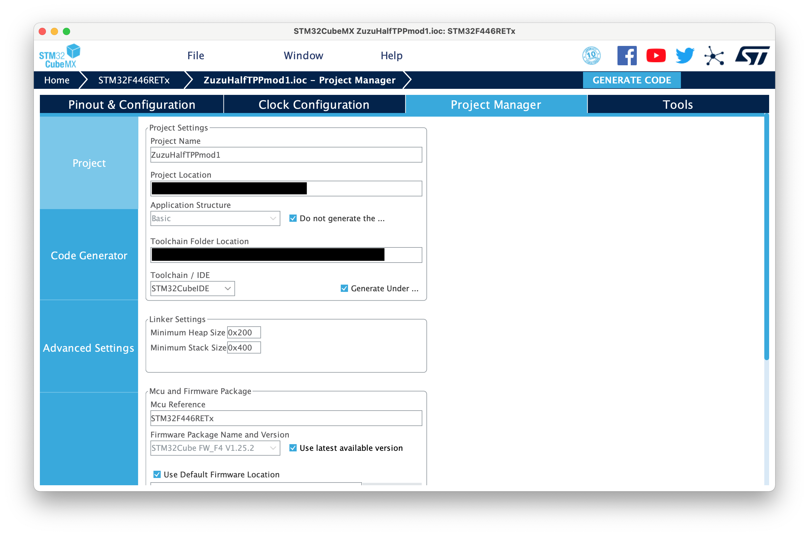
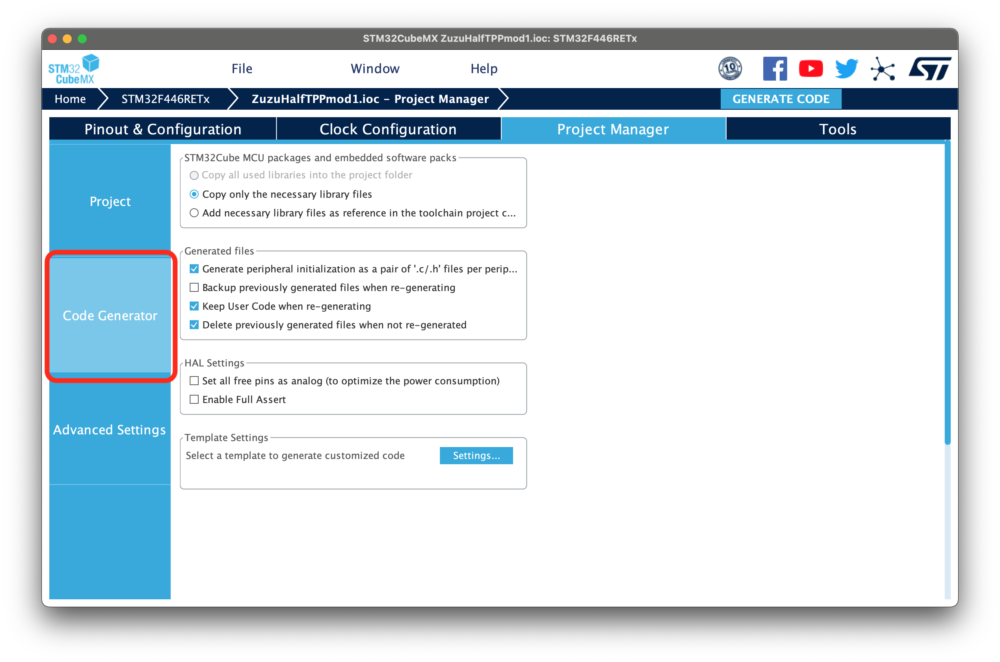
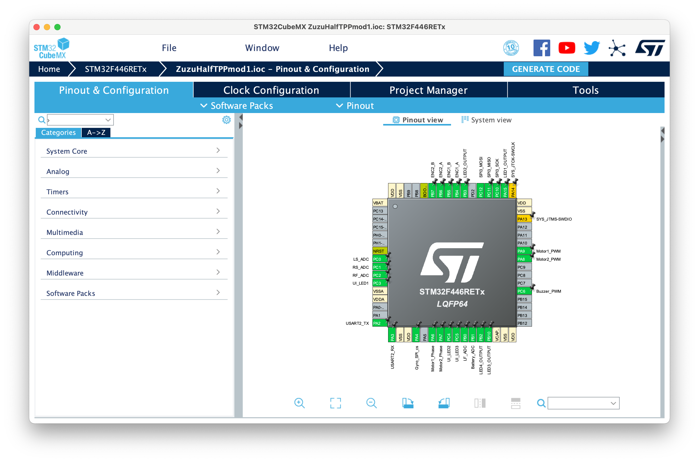

# MSLH [Micromouse Standard Library for HALDriver]

[author: Kazushi Kurasawa (KuraZuzu)]

This is a library for mobile robots using HALDriver With c++ <br>
Please refer to the following [repository](https://github.com/KuraZuzu/MSLH.git) for instructions).

You need generate code from .ioc(STM32CubeMX) project.
This project .ioc version : 6.2.1

これはマイクロマウス向けのc/c++プログラムであり，HALドライバを用いています．

.ioc ファイル(STM32CubeMX)によるピンや内部クロックの設定から生成されたコードを必要とします．このプロジェクトではCmakeに向けて解説します．

また，説明のために`MSLH`が`ZuzuHalfTPPmod1`というProjectに内包されているものと仮定します．

<br>

CMSIS-DSPライブラリがSTM32Cubeの`<STM32Cubeのディレクトリ>/STM32Cube/Repository/<現在のファームウェアバージョン(例:STM32Cube_FW_F4_V1.26.1)>/Drivers/CMSIS/DSP/`に存在します．

この中の`Include`と`Source`をコピーして，プロジェクトの`Drivers/CMSIS/DSP(なければ作る)`に配置し，コンパイルの設定に追加します．

これは，`CMakeLists.txt`の`nclude_directories()`に`Drivers/CMSIS/DSP/Include`を追加すれば大丈夫です．



<br>

また，
```cmake:CMakeLists.txt
add_definitions(-DARM_MATH_CM4 -DARM_MATH_MATRIX_CHECK -DARM_MATH_ROUNDING -D__FPU_PRESENT=1)
```
を
```cmake:CMakeLists.txt
include_directories(Inc Drivers/STM32F4xx_HAL_Driver/Inc Drivers/STM32F4xx_HAL_Driver/Inc/Legacy Drivers/CMSIS/Device/ST/STM32F4xx/Include Drivers/CMSIS/Include Drivers/CMSIS/DSP/Include)
```
の後に追加します．

<br>

FPUを有効化するために以下の2点の静的ライブラリも加えます．
- `arm_cortexM4lf_math.lib`
- `libarm_cortexM4lf_math.a <br>`

これは，`<STM32Cubeのディレクトリ>/STM32Cube/Repository/<現在のファームウェアバージョン>/Drivers/CMSIS/Lib`の中の`./ARM`と`./GCC`内にあります<br>

これらをリンクする方法として

```cmake:CMakeLists.txt
target_link_libraries(${PROJECT_NAME}.elf ${CMAKE_SOURCE_DIR}/Drivers/CMSIS/Lib/ARM/arm_cortexM4lf_math.lib ${CMAKE_SOURCE_DIR}/Drivers/CMSIS/Lib/GCC/libarm_cortexM4lf_math.a)
```
を

```cmake:CMakeLists.txt
add_executable(${PROJECT_NAME}.elf ${SOURCES} ${LINKER_SCRIPT} )
```

の後に加えてください．


このリポジトリのプロジェクト設定等は KuraZuzu(リポジトリ管理者) の機体向けのものであるため，自分で設定した .iocファイル で`Generate Code`による上書きを行えば自動で更新してくれます．
ただし，動作確認をしたのはJetbrain社のIDEであるCLionのみです．

※`Generate Code`の際には，main関数のコールバックを呼ばない設定にしてください. 各設定ファイルが全て`main.c`に生成されてしまいます．(2023/07/16 現在)




